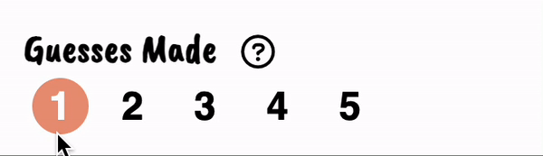
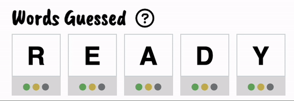

# Overview

This app helps users guess the word on [Wordle](https://www.nytimes.com/games/wordle/index.html) by displaying the remaining possible words given the results of the guesses made so far.

## How to Use

* **Step 1**\
  \
  &nbsp;Choose how many guesses you've made so far on Wordle.  After doing so, the corresponding number of rows will be enabled in the section below for you to input your guessed words.  Since Wordle only allows up to 6 tries, this helper can only be used until after you've made 5 guesses.

* **Step 2**\
  \
  &nbsp;Fill in all enabled rows with the words that have been guessed so far.  Click on the color button under each letter to change the color of the box and copy the resulting colors after the guesses were made on Wordle.

* **Step 3**\
  &nbsp;Click on SUBMIT to generate the list of remaining possible words.
